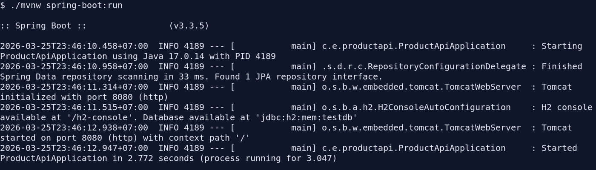
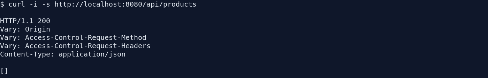
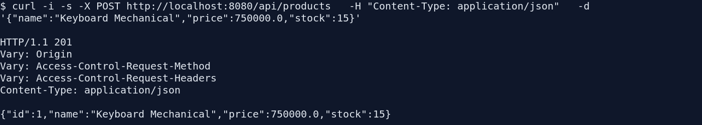
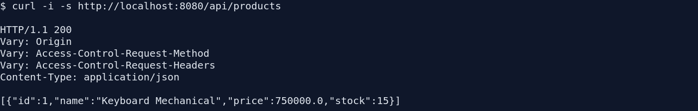
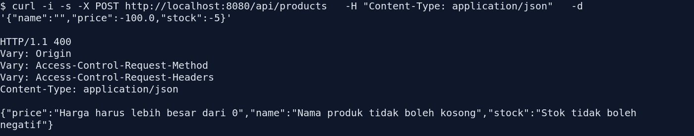
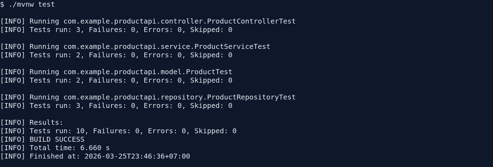

# Laporan Pembuatan Backend Modul Fullstack EAI

## 1. Tujuan

Membangun backend REST API sesuai modul praktikum Fullstack EAI menggunakan Spring Boot untuk sistem manajemen produk sederhana. Backend ini menyediakan endpoint untuk melihat daftar produk dan menambahkan produk baru, lengkap dengan validasi dan pengujian otomatis.

## 2. Langkah-Langkah Pengerjaan

### 2.1 Analisis Kebutuhan Modul

Berdasarkan dokumen `Modul_FullStack_Produk_EAI.pdf`, bagian backend membutuhkan:

- Spring Boot dengan Java
- Entity `Product`
- Layer `repository`, `service`, dan `controller`
- DTO request/response
- Validasi data
- Database H2
- Unit test dan integration test

### 2.2 Setup Project

Project dibuat pada folder `product-api` dengan struktur utama:

- `src/main/java/com/example/productapi/ProductApiApplication.java`
- `src/main/java/com/example/productapi/model/Product.java`
- `src/main/java/com/example/productapi/dto/ProductRequest.java`
- `src/main/java/com/example/productapi/dto/ProductResponse.java`
- `src/main/java/com/example/productapi/repository/ProductRepository.java`
- `src/main/java/com/example/productapi/service/ProductService.java`
- `src/main/java/com/example/productapi/controller/ProductController.java`
- `src/main/java/com/example/productapi/exception/GlobalExceptionHandler.java`
- `src/main/resources/application.properties`

Selain itu dibuat `mvnw` agar project bisa dijalankan konsisten dengan Maven lokal di workspace dan Java 17.

### 2.3 Implementasi Backend

Implementasi dilakukan per layer:

1. Entity `Product`
   Menyimpan data `id`, `name`, `price`, dan `stock`.
2. DTO
   `ProductRequest` dipakai untuk request dari client dan `ProductResponse` untuk response API.
3. Repository
   `ProductRepository` meng-extend `JpaRepository<Product, Long>`.
4. Service
   `ProductService` menangani logika bisnis `getAllProducts()` dan `createProduct()`.
5. Controller
   `ProductController` menyediakan endpoint:
   - `GET /api/products`
   - `POST /api/products`
6. Validasi
   Request divalidasi dengan:
   - `@NotBlank` pada `name`
   - `@Positive` pada `price`
   - `@PositiveOrZero` pada `stock`
7. Error Handler
   `GlobalExceptionHandler` mengembalikan error validasi dalam format JSON.

### 2.4 Konfigurasi Database

Database yang dipakai adalah H2 in-memory dengan konfigurasi:

- `spring.datasource.url=jdbc:h2:mem:testdb`
- `spring.h2.console.enabled=true`
- `spring.jpa.hibernate.ddl-auto=update`

### 2.5 Pengujian

Test yang dibuat:

- `ProductTest`
- `ProductServiceTest`
- `ProductRepositoryTest`
- `ProductControllerTest`

Total test yang berhasil dijalankan: `10 test`, dengan hasil:

- `Failures: 0`
- `Errors: 0`
- `Skipped: 0`

## 3. Hasil Implementasi

### 3.1 Endpoint yang Tersedia

#### GET `/api/products`

Mengambil semua data produk.

Contoh response:

```json
[
  {
    "id": 1,
    "name": "Keyboard Mechanical",
    "price": 750000.0,
    "stock": 15
  }
]
```

#### POST `/api/products`

Menambahkan produk baru.

Contoh request:

```json
{
  "name": "Keyboard Mechanical",
  "price": 750000.0,
  "stock": 15
}
```

Contoh response:

```json
{
  "id": 1,
  "name": "Keyboard Mechanical",
  "price": 750000.0,
  "stock": 15
}
```

#### Response Validasi Error

Jika input tidak valid, API mengembalikan response seperti berikut:

```json
{
  "price": "Harga harus lebih besar dari 0",
  "name": "Nama produk tidak boleh kosong",
  "stock": "Stok tidak boleh negatif"
}
```

## 4. Bukti Running dan Testing

### 4.1 Backend Berjalan



4.2 Hasil GET Awalp



### 4.3 Hasil POST Berhasil



### 4.4 Hasil GET Setelah Insert



### 4.5 Hasil Validasi Error



### 4.6 Hasil Automated Test



## 5. Kesimpulan

Backend modul Fullstack EAI berhasil dibuat sesuai kebutuhan utama modul. Sistem sudah memiliki arsitektur layer yang jelas, validasi input, database H2, serta automated testing yang lulus seluruhnya. Dengan backend ini, frontend dari modul dapat langsung diintegrasikan melalui endpoint `/api/products`.
